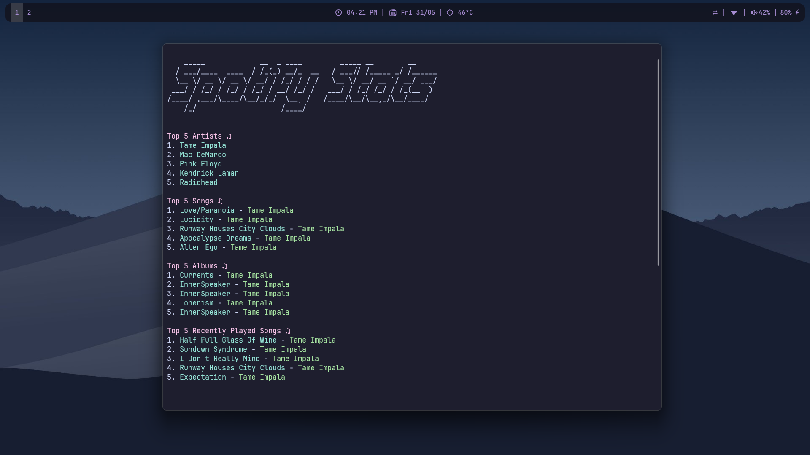

# Spotify-stats ♫
A script written in Python to get your Spotify stats



## ✨ Features

Displays:
- currently playing song at the top with a distinctive color.
- top 5 artists based on listening history.
- top 5 songs you've listened to recently.
- top 5 albums.
- top 5 songs you've recently played.


## ⚙️ Requirements

- Python 3.x
- `spotipy` library (install it via `pip install spotipy`)
- `colorama` library (install it via `pip install colorama`)
- `pyfiglet` library (install it via `pip install pyfiglet`)

## 📄 Usage
1. Clone this repository.
```bash
git clone https://github.com/ashish0kumar/Spotify-stats.git
```
2. Install the dependencies 
```bash
pip install -r requirements.txt
```

3. Configure Spotify API credentials:
Create a Spotify App on the Spotify Developer Dashboard.
Obtain your `CLIENT_ID` and `CLIENT_SECRET.`
Set the `REDIRECT_URI` to http://localhost:5173/callback/ (you can set it to any URL you want to but you'll have to edit `REDIRECT_URI` in the script as well to match it) in your Spotify App settings.

5. Update stats.py: Replace the placeholders in the get_spotify_stats function with your `CLIENT_ID` and `CLIENT_SECRET`.
6. You can now run the stats.py script to get the stats.
```bash
python stats.py
```

## 📜 License
This project is licensed under the MIT License.
